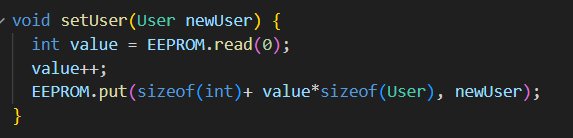

# MANUAL TÉCNICO - PROYECTO 1

GRUPO 15

## Objetivos Generales

1. Crear un prototipo para un sistema de cargado de celulares, los usuarios registrados podrán obtener acceso temporal a un espacio para la carga de su dispositivo. 
2. Específicamente se solicita la implementación de un prototipo simulado y otro físico.
3. Desarrollar un software que permita al usuario loguearse, encontrar su telefono y cargarlo de manera remota.

## REQUERIMIENTOS
### Simulación
 - Proteus 8.10 SP0 (Build 29203) (Para Simulacion)
 - Arduino IDE (para compilacion de binarios)
### Componentes
 - 1 Arduino Mega
 - 1 Driver Max7219
 - 4 Botones
 - 6 Resistencias
 - 2 Potenciometros
 - 2 Matrices 8x8
 - Pantalla LCD de 16x4
 - Módulo Bluetooth
 - Sensor de temperatura LM35
 - Pantalla LCD de 16x2
 - 2 Sensores ultrasónicos
 - 2 Módulos de fotoresistencia

 
 ### Librerias
 
 - LedControl
 - LiquidCrystal
 - Keypad
 - EEPROM

## Conexiones Proteus

### Arduino Mega

 - Los pines 10 - 13 son utilizados para los botones (CONFIG, DIRECTION, RIGHT, LEFT)
 - Los pines 47-49 Son utilizados para la matriz con Driver 

### Driver MAX7219
El driver recibe como entradas los pines 51,52,53 de arduino mega en sus entradas DIN, LOAD, CLK respectivamente
Y como salidas tiene A-G y DP y D0-D7 como envio de datos a la matriz 8x8

### Control
El control se compone por:

 - 1 Matrices
	 - La matriz recibe las salidas del driver MAX7219
 - 3 Botones conectados como entradas a el Arduino Mega segun su etiqueta
     - Aceptar - PIN 8
	 - Cancelar - PIN 9
	 - Borrar - PIN 10
 - 12 Botones en un teclado 3*4
	 
 - 1 pantalla LCD
 

## Codigo Arduino

### Bloque de declaraciones

Este bloque contiene todas las variables, definiciones y constantes requeridas para el control de las matrices led, botones, potenciometros.. se encuentra comentado por bloque segun se ocupa.

### Bloque SETUP

Este bloque se encarga de definir el modo de los pines e inicializacion de objetos.

### Bloque LOOP

El bloque "loop" en Arduino es una estructura de control que se utiliza para repetir una sección de código de forma continua mientras la placa Arduino esté alimentada y funcionando.

## Funciones y Metodos utilizados por los bloques anteriores

### Menu()

<!-- agregar una breve descripcion de lo que hacen -->

### Cifrado()

<!-- agregar una breve descripcion de lo que hacen -->

### EscribirPantalla()

<!-- agregar una breve descripcion de lo que hacen -->

### MenuAdmin()

<!-- agregar una breve descripcion de lo que hacen -->

### MenuUsuario()

<!-- agregar una breve descripcion de lo que hacen -->

### Setup()

Reiniciara el estado del juego con los valores predeterminados al iniciar un nuevo juego

### registro()

Se registrara un usuario nuevo

### inicioSesion()

Se iniciara sesion con un usuario

### getName()

Se verificara por medio del nombre si el usuario existe

### getUser()

Se obtendra el usuario por medio del nombre

### isUserByNameAndPassword()

Se obtendra el usuario por medio del nombre

### isUserByNameAndPassword()

Se verificara si exsite el usuario por medio del nombre y el password

### getUserByNameAndPassword()

Se obtendra el usuario por medio del nombre y el password

### setUser()

Se guardara un nuevo usuario en la eeprom
<!-- Agregar las funciones que no esten y que ustedes hayan hecho -->
